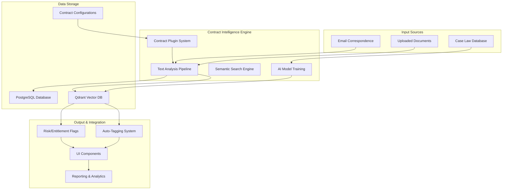

# VeriCase Contract Intelligence Layer Architecture

## Overview
This document outlines the architecture for implementing a contract-aware intelligence layer in VeriCase that can automatically detect contract clauses, flag entitlement and risk, and provide semantic understanding of correspondence content.

## System Architecture



## Core Components

### 1. Contract Plugin System
- **JCT Design & Build 2016** (Primary implementation)
- **NEC Contracts** (Future expansion)
- **FIDIC Contracts** (Future expansion)
- **Custom Contract Types** (Configurable)

### 2. Text Analysis Pipeline
- **Keyword Pattern Matching** (Regex-based clause detection)
- **Semantic Similarity** (Vector embeddings for context understanding)
- **Confidence Scoring** (Match accuracy assessment)
- **Multi-language Support** (English primary, configurable)

### 3. Data Storage Architecture
- **Vector Database (Qdrant)**: Stores semantic embeddings for contract terms and case law
- **PostgreSQL**: Stores structured contract configurations and analysis results
- **S3/File Storage**: Contract document storage and case law PDFs

### 4. AI Model Training Pipeline
- **Contract-specific training** on JCT D&B 2016 terminology
- **Continuous learning** from case law and user feedback
- **Model versioning** and A/B testing capabilities

## Integration Points

### Email Processing Integration
```python
# Example integration with email processing
def process_email_with_contract_intelligence(email_content: str, contract_type: str) -> AnalysisResult:
    """Analyze email content against specified contract type"""
    contract_plugin = get_contract_plugin(contract_type)
    return contract_plugin.analyze_text(email_content)
```

### Evidence Tagging Integration
```python
# Auto-tagging evidence items based on contract analysis
def auto_tag_evidence(evidence_item: EvidenceItem, analysis_result: AnalysisResult):
    """Apply contract intelligence tags to evidence items"""
    evidence_item.auto_tags.extend(analysis_result.relevant_clauses)
    evidence_item.auto_tags.extend(analysis_result.risk_flags)
    evidence_item.auto_tags.extend(analysis_result.entitlement_flags)
```

## Key Features to Implement

### 1. Contract-Aware Auto-Tagging
- Automatic detection of contract clauses in correspondence
- Context-aware tagging with confidence scores
- Multi-contract type support

### 2. Risk & Entitlement Flagging
- Real-time identification of potential claims
- Risk assessment scoring
- Entitlement probability estimation

### 3. Semantic Search
- Natural language querying of contract terms
- Similarity-based clause retrieval
- Case law precedent matching

### 4. Reporting & Analytics
- Contract clause frequency analysis
- Risk exposure reporting
- Entitlement tracking over time

## Implementation Phases

### Phase 1: Foundation (Current)
- [ ] Resolve Qdrant connectivity
- [ ] Enhance JCT D&B 2016 configuration
- [ ] Basic integration with email processing
- [ ] Simple auto-tagging implementation

### Phase 2: Advanced Features
- [ ] Semantic search implementation
- [ ] Risk/entitlement scoring
- [ ] UI integration
- [ ] Basic reporting

### Phase 3: Maturity
- [ ] Multi-contract support
- [ ] AI model training
- [ ] Advanced analytics
- [ ] Case law integration

## Technical Requirements

### Backend Services
- Python 3.9+
- FastAPI/Starlette
- Qdrant vector database
- PostgreSQL with pgvector
- Redis for caching

### Machine Learning
- SentenceTransformers for embeddings
- Scikit-learn for classification
- HuggingFace Transformers (optional)

### Frontend Integration
- AG Grid enhancements
- Real-time tagging display
- Search interface
- Analytics dashboards

## Data Models

### Contract Analysis Result
```python
class ContractAnalysisResult(BaseModel):
    relevant_clauses: List[str] = []
    risk_flags: List[str] = []
    entitlement_flags: List[str] = []
    confidence_scores: Dict[str, float] = {}
    suggested_actions: List[str] = []
    matched_patterns: List[Dict[str, Any]] = []
```

### Contract Configuration
```python
class ContractConfiguration(BaseModel):
    contract_type: str
    version: str
    clauses: Dict[str, ClauseDefinition]
    patterns: List[PatternDefinition]
    risk_keywords: List[str]
    entitlement_keywords: List[str]
    vector_embeddings: Optional[Dict[str, List[float]]] = None
```

## Next Steps

1. **Immediate**: Resolve Qdrant database connectivity issue
2. **Short-term**: Complete JCT D&B 2016 clause coverage
3. **Medium-term**: Integrate with email processing pipeline
4. **Long-term**: Implement AI model training and case law integration